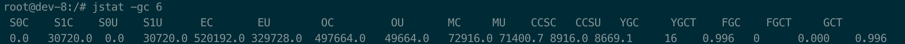

# JVM调优

```bash
java -XX:+PrintFlagsInitial # 打印默认参数
-Xmn700M #设置年轻代大小
-XX:+AlwaysPreTouch
```

```bash
root@k8s02:/# jmap -heap 6
Attaching to process ID 6, please wait...
Debugger attached successfully.
Server compiler detected.
JVM version is 25.222-b10

using thread-local object allocation.
Mark Sweep Compact GC

Heap Configuration:
   MinHeapFreeRatio         = 40
   MaxHeapFreeRatio         = 70
   MaxHeapSize              = 2147483648 (2048.0MB)
   NewSize                  = 1073676288 (1023.9375MB)
   MaxNewSize               = 1073741824 (1024.0MB)
   OldSize                  = 65536 (0.0625MB)
   NewRatio                 = 2
   SurvivorRatio            = 8
   MetaspaceSize            = 21807104 (20.796875MB)
   CompressedClassSpaceSize = 1073741824 (1024.0MB)
   MaxMetaspaceSize         = 17592186044415 MB
   G1HeapRegionSize         = 0 (0.0MB)

Heap Usage:
New Generation (Eden + 1 Survivor Space):
   capacity = 966328320 (921.5625MB)
   used     = 729934448 (696.1197357177734MB)
   free     = 236393872 (225.44276428222656MB)
   75.53689909450237% used
Eden Space:
   capacity = 858980352 (819.1875MB)
   used     = 729934448 (696.1197357177734MB)
   free     = 129045904 (123.06776428222656MB)
   84.97685032032025% used
From Space:
   capacity = 107347968 (102.375MB)
   used     = 0 (0.0MB)
   free     = 107347968 (102.375MB)
   0.0% used
To Space:
   capacity = 107347968 (102.375MB)
   used     = 0 (0.0MB)
   free     = 107347968 (102.375MB)
   0.0% used
tenured generation:
   capacity = 1748992 (1.66796875MB)
   used     = 1048520 (0.9999465942382812MB)
   free     = 700472 (0.6680221557617188MB)
   59.94995974824356% used
```


-Xmx2g


-Xms1g -Xmx2g -Xmn800m


-Xms2g -Xmx2g -Xmn800m


-Xms1g -Xmx2g -Xmn720m


-Xms1g -Xmx2g -XX:UseG1GC


-Xms2g -Xmx2g -XX:UseG1GC


-Xms2g -Xmx2g -Xmn800m -XX:+UseG1GC


-Xms2g -Xmx2g -XX:+UseG1GC -XX:NewRatio=1


-Xms2g -Xmx2g -XX:+UseG1GC -XX:NewRatio=1 -XX:ParallelGCThreads=2


-Xms2g -Xmx2g -XX:+UseG1GC -XX:NewRatio=1 -XX:ParallelGCThreads=2 -XX:ConcGCThreads=2


开发 -Xmx1024m


-Xms2g -Xmx2g -XX:+UseG1GC -XX:NewRatio=1 -XX:ParallelGCThreads=2 -XX:ConcGCThreads=2


-Xms2g -Xmx2g -XX:+UseG1GC -XX:NewRatio=1 -XX:ParallelGCThreads=2


-Xms1g -Xmx1g -XX:+UseG1GC -XX:NewRatio=1 -XX:ParallelGCThreads=2 -XX:ConcGCThreads=2



-Xms1g -Xmx2g -XX:+UseG1GC -XX:NewRatio=1 -XX:ParallelGCThreads=2 -XX:ConcGCThreads=2


