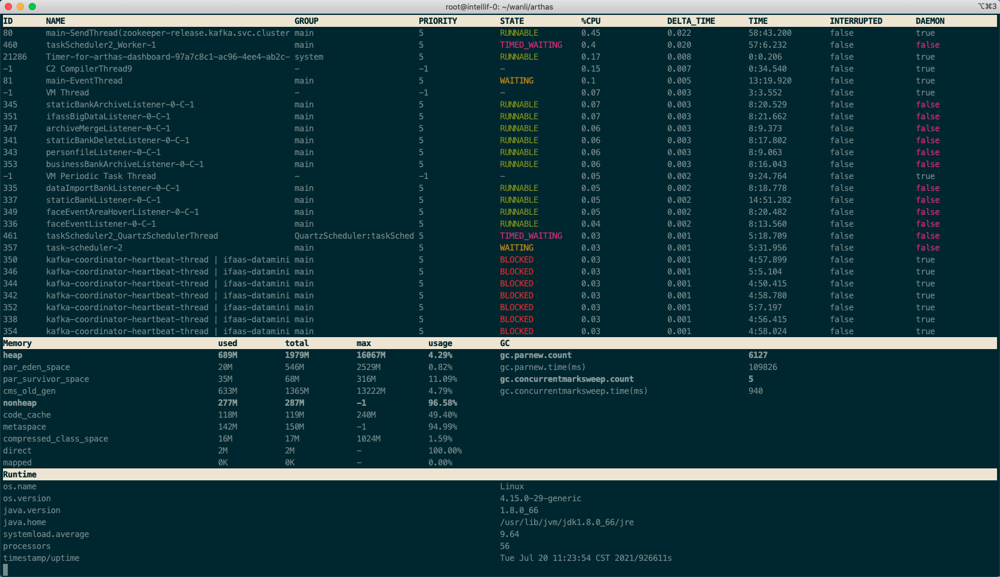
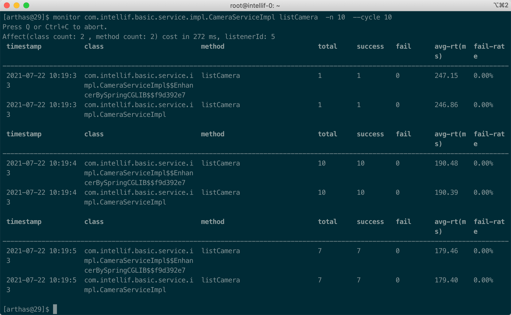
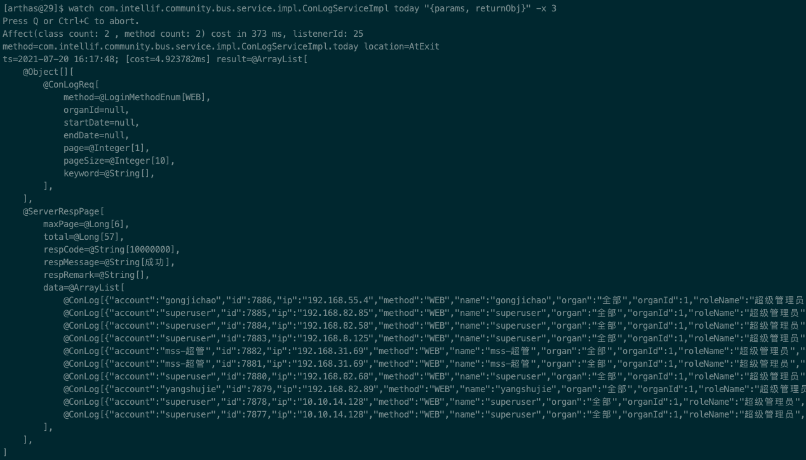
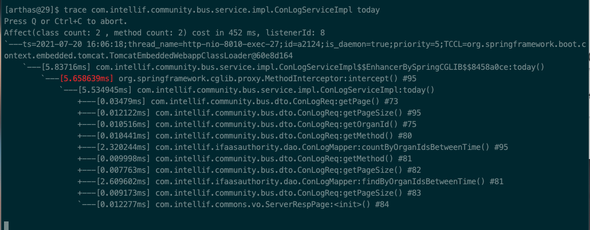
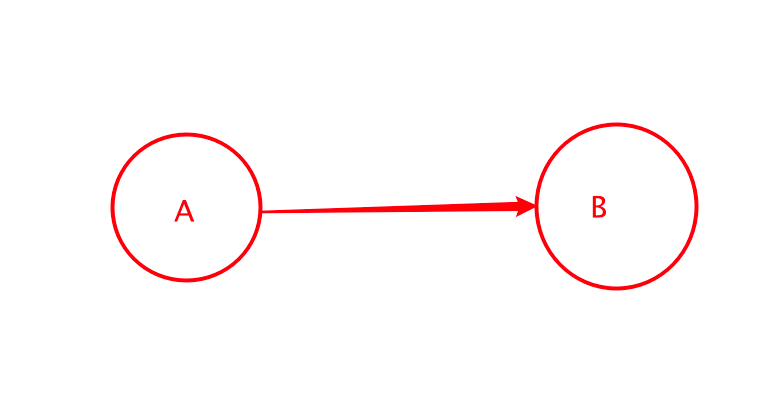
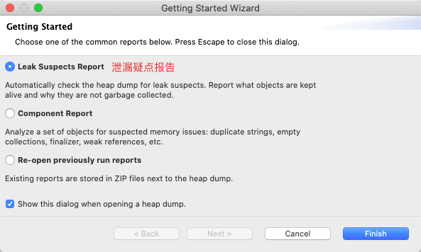
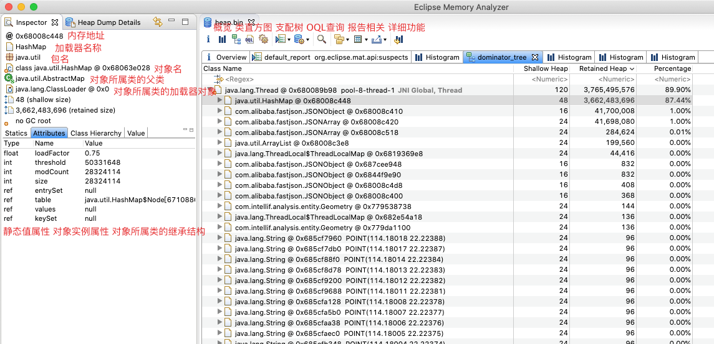
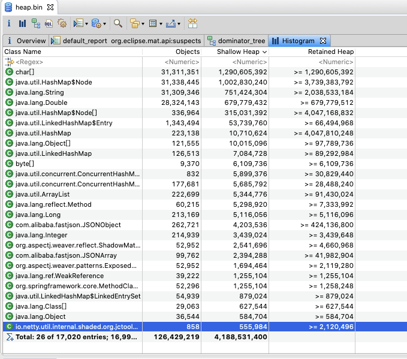
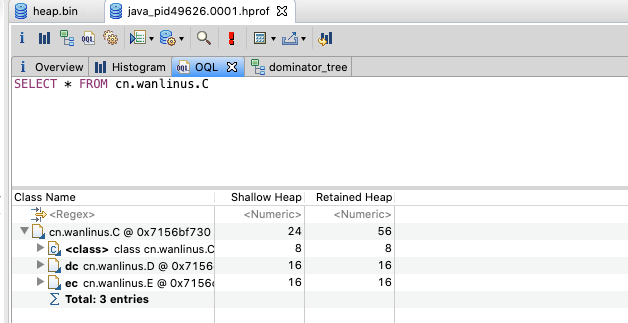
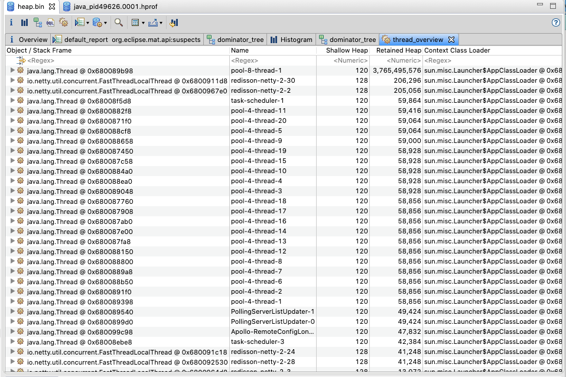

# Java线上问题性能分析 

关键词  JVM MAT arthas

[TOC]

场景:

1. 遇到问题无法在线上 debug，难道只能通过加日志再重新发布吗？
2. 线上遇到某个用户的数据处理有问题，但线上同样无法 debug，线下无法重现！
3. 有什么办法可以监控到JVM的实时运行状态？
4. 内存使用增大, OOM
5. api耗时突然增加
6. 代码没打日志, 传入参数和传出数据不确定


## [Arthas](https://arthas.aliyun.com/doc/index.html)

`Arthas` (阿尔萨斯)是Alibaba开源的Java诊断工具

### 安装:

```bash
kubectl -n basic-app exec -it xxxxxx -- bash -c "curl -O https://arthas.aliyun.com/arthas-boot.jar&&java -jar arthas-boot.jar"
```

```
https://github.com/alibaba/arthas/releases 
下载 zip包, 解压, 运行
java -jar arthas-boot.jar
```

dashboard, thread, profiler, monitor, watch, trace, stack

### Dashboard



### Monitor

对某个类的某个方法进行周期性监控，来输出方法的平均响应时间，成功失败次数，调用次数等



### watch 查看函数入参, 返回值/异常信息

```bash
watch com.intellif.community.bus.service.impl.ConLogServiceImpl today "{params, returnObjs}" -x 3
```



### Trace

```bash
trace com.intellif.community.bus.service.impl.ConLogServiceImpl today
```




## MAT

MAT(Memory Analyzer Tool)，一个基于Eclipse的内存分析工具，是一个快速、功能丰富的JAVA heap分析工具，它可以帮助我们查找内存泄漏和减少内存消耗

### **Heap Dump**

Heap Dump是Java进程在某个时刻的内存快照，不同JVM的实现的Heap Dump的文件格式可能不同，进而存储的数据也可能不同，但是一般来说。

Heap Dump中主要包含当生成快照时堆中的java对象和类的信息，主要分为如下几类：

- 对象信息：类名、属性、基础类型和引用类型
- 类信息：类加载器、类名称、超类、静态属性
- gc roots：JVM中的一个定义，进行垃圾收集时，要遍历可达对象的起点节点的集合
- 线程栈和局部变量：快照生成时候的线程调用栈，和每个栈上的局部变量

Heap Dump中没有包含对象的分配信息，因此它不能用来分析这种问题：一个对象什么时候被创建、一个对象时被谁创建的。

### **Shallow vs. Retained Heap**

**Shallow heap**是一个对象本身占用的堆内存大小

**Retained Heap**实际占用的堆内存



### 安装:

```
/Applications/mat.app/Contents/Eclipse/MemoryAnalyzer.ini
```

File->Open Heap Dump...

```
> jps 
	60569 Jps
	29 jar
> jmap -dump:live,format=b,file=heap.bin <pid> //生成堆转储快照dump文件
```





 

### **类直方图**

堆直方图是从类的角度看哪些类及该类的实例对象占用着内存情况

Retained Heap值是一个大概值, 因为计算总的值非常消耗计算机资源



### **Dominator Tree**

Dominator ['dɒmɪneɪtə]

MAT根据堆上的对象引用关系构建了支配树 (Dominator Tree), 通过支配树可以很方便得识别出哪些对象占用了大量的内存, 并可以看到它们之间的依赖关系. 

支配树可以用于查看heap dump中占用内存最大的对象。在支配树中，对于某一层的节点来说，如果它们的parent节点没有被其他对象引用了，那么这写节点都会被垃圾收集器回收。

这就可以直接根据支配树直接找到占用内存最大的引用对象

### **OQL查询**

MAT提供另一种类似SQL的对象查询语言——OQL，可以用类似SQL语句的方式查询heap dump中的对象.



### **线程视图**

在线程视图这个表中，可以看到以下几个信息：线程对象的名字、线程名、线程对象占用的堆内存大小、线程对象的保留堆内存大小、线程的上下文加载器、是否为守护线程。

选中某个线程对象展开，可以看到线程的调用栈和每个栈的局部变量，通过查看线程的调用栈和局部变量的内存大小，可以找到在哪个调用栈里分配了大量的内存。



### 问题分析:

Heap Dump Overview

Leak Suspects (泄漏疑点)

Top components


参考文档:

- How much memory do I need - https://plumbr.io/blog/memory-leaks/how-much-memory-what-is-retained-heap

- JVM 内存分析神器 MAT: Incoming Vs Outgoing References 你真的了解吗?- https://cloud.tencent.com/developer/article/1530223
