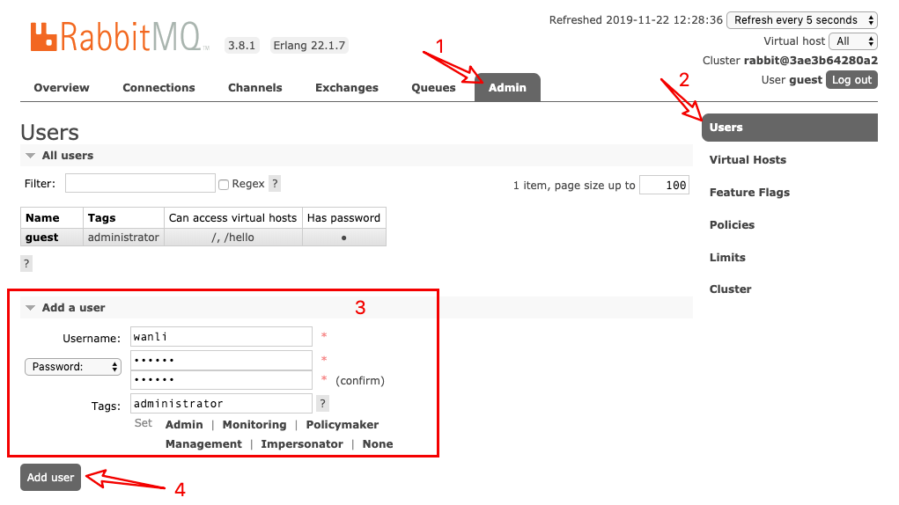
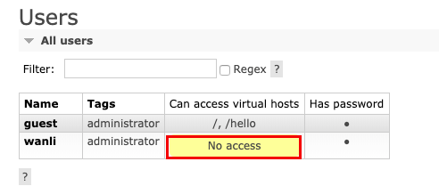
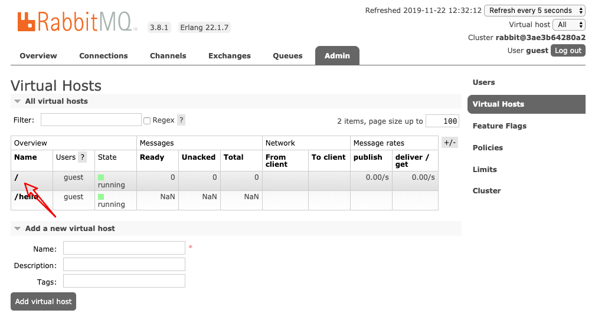
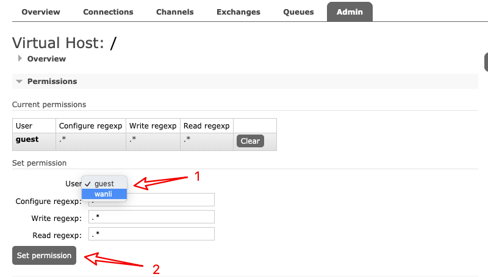
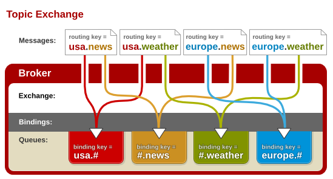
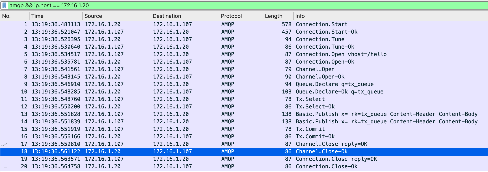
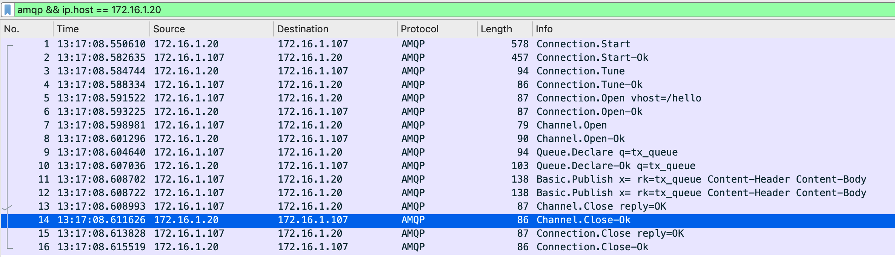
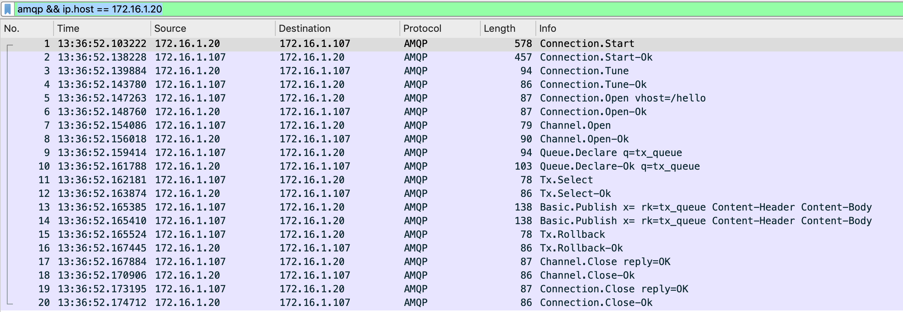
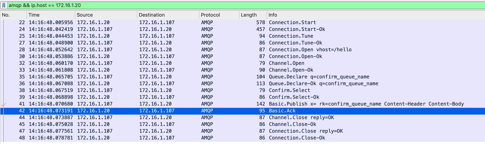
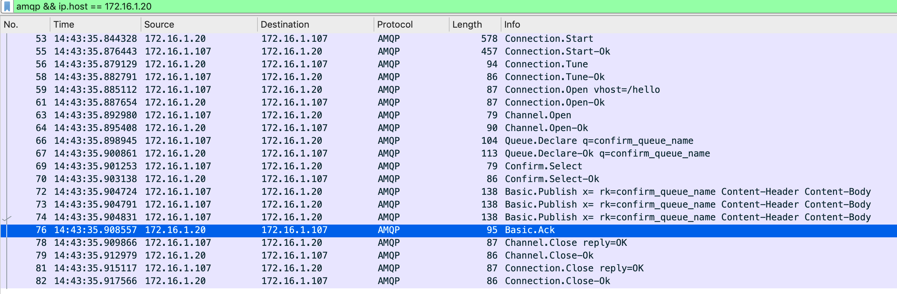

# 消息队列之RabbitMQ

[TOC]

RabbitMQ是一个由erlang开发的AMQP(Advanced Message Queuing Protocol)开源实现

## 特性

RabbitMQ最起初起源于金融系统, 用于在分布式系统中存储转发消息, 在易用性, 扩展性,高可用性方面表现不俗,具体包括

- 可靠性(Reliability)

- 灵活的路由(Flexible Routing)
- 消息集群(Clustering)
- 高可用(Highly Available Queues)
- 多协议(Multi-protocol)
- 多语言客户端(many client)
- 拥有管理界面(Management UI)
- 跟踪机制(Tracing)
- 多插件(plugin system)

## 基本概念

- **Message**

  消息，消息是不具名的，它由消息头和消息体组成。消息体是不透明的，而消息头则由一系列的可选属性组成，这些属性包括routing-key（路由键）、priority（相对于其他消息的优先权）、delivery-mode（指出该消息可能需要持久性存储）等.

- **Publisher**

  消息生产者, 也就是一个像交换机发布消息的客户端应用程序

- **Exchange**

  交换器，用来接收生产者发送的消息并将这些消息路由给服务器中的队列。 

- **Routing Key**

  路由关键字,exchange根据这个关键字进行消息投递。

- **Binding**

  绑定，用于消息队列和交换器之间的关联。一个绑定就是基于路由键将交换器和消息队列连接起来的路由规则，所以可以将交换器理解成一个由绑定构成的路由表。

- **Queue**

  消息队列，用来保存消息直到发送给消费者。它是消息的容器，也是消息的终点。一个消息可投入一个或多个队列。消息一直在队列里面，等待消费者连接到这个队列将其取走。

- **Connection**

  是一个RabbitMQ的socket链接, 它封装了socket协议相关部分逻辑

- **Channel**

  信道，多路复用连接中的一条独立的双向数据流通道。信道是建立在真实的TCP连接内地虚拟连接，AMQP 命令都是通过信道发出去的，不管是发布消息、订阅队列还是接收消息，这些动作都是通过信道完成。因为对于操作系统来说建立和销毁 TCP 都是非常昂贵的开销，所以引入了信道的概念，以复用一条 TCP 连接。

- **Consumer**

  消息的消费者，表示一个从消息队列中取得消息的客户端应用程序。

- **Virtual Host**

  虚拟主机，表示一批交换器、消息队列和相关对象。虚拟主机是共享相同的身份认证和加密环境的独立服务器域。每个 vhost 本质上就是一个 mini 版的 RabbitMQ 服务器，拥有自己的队列、交换器、绑定和权限机制。vhost 是 AMQP 概念的基础，必须在连接时指定，RabbitMQ 默认的 vhost 是 / , 可以类似于MySQL里的数据库。

- **Broker**

  表示消息队列服务器实体。它提供一种传输服务,它的角色就是维护一条从生产者到消费者的路线，保证数据能按照指定的方式进行传输.

## 安装

RabbitMQ官网提供了多种安装方式, 我推荐使用[docker](https://hub.docker.com/_/rabbitmq), 命令如下:

```bash
docker run -d -p 5672:5672 -p 15672:15672 --name rabbitmq rabbitmq:management
```

点击[访问](http://10.0.0.20:15672) 登陆, 输入默认用户名和密码guest/guest. 在生产中一般是不使用这个账号, 所以需要新建一个



新建用户在用户列表发现没有访问virtual host的权限,在rabbitmq中 Virtual Hosts相当于数据库, 访问全系需要单独设置



这里点击右侧Virtual Hosts, 找到`/`, 点击进入设置权限. 将新建的用户设置相应的权限.





RabbitMQ提供了很多种消息传递模式

## 简单消息队列


图中P代表消息生产者(Publisher),  C代表消息消费者(Consumer)

```java
//首先使用ConnectionFactory获取connection
public final class ConnectionUtils {
    public static Connection getConnection() throws IOException, TimeoutException {
        ConnectionFactory factory = new ConnectionFactory();
        factory.setHost("10.0.0.20");
        factory.setPort(5672);
        factory.setVirtualHost("/hello");
        factory.setUsername("wanli");
        factory.setPassword("123456");
        return factory.newConnection();
    }
}
// 简单模式的消息生产者
public class SimpleSender {
    private static final Logger logger = LoggerFactory.getLogger(SimpleSender.class);
    static final String QUEUE_NAME = "queue_1";

    public static void main(String[] args) throws IOException, TimeoutException {
        //创建一个通道
        try (Connection connection = ConnectionUtils.getConnection();
             Channel channel = connection.createChannel()) {
            channel.queueDeclare(QUEUE_NAME, false, false, false, null);
            String msg = "hello simple";
            channel.basicPublish("", QUEUE_NAME, null, msg.getBytes());
            logger.info("send rabbit message:[{}]", msg);
        }
    }
}
// 简单模式的消息消费者
public class SimpleReceiver {
    private static final Logger logger = LoggerFactory.getLogger(SimpleReceiver.class);
    public static void main(String[] args) throws Exception {
        Connection connection = ConnectionUtils.getConnection();
        Channel channel = connection.createChannel();
        channel.queueDeclare(QUEUE_NAME, false, false, false, null);
        //监听队列
        channel.basicConsume(QUEUE_NAME, true, (consumerTag, message) -> {
            logger.info("Received message:[{}]", new String(message.getBody(), StandardCharsets.UTF_8));
        }, consumerTag -> {
        });
        // 这里不暂停可能还没开始收消息就退出程序了, 简单处理了
        Thread.sleep(1000);
        channel.close();
        connection.close();
    }
}
```

这种模式的优点是代码简单, 容易理解, 但是耦合性过高, 生产者和消费者一对一使用, 无法适用于多个消费者的情况, 这个问题可以使用work queue模式解决

## Work Queue


工作队列(work queue)主要的思想是想避免立即执行资源密集型任务, 而不得不等待他完成. 相反, 安排的任务在以后完成. 我们将任务封装为消息(Message)并将其发送到队列(queue). 在后台运行的工作进程将弹出任务并最终执行作业, 当有多个消费者时任务将在他们之间共享

工作队列将用于在多个消费者之间分配比较耗时的任务. 使用Work Queue存在两种模式, **轮询分发**, 和**公平分发**

### 轮询分发(Round-robin dispatching)

```java
//生产者和简单消息队列一样
Connection connection = ConnectionUtils.getConnection();
Channel channel = connection.createChannel();
channel.queueDeclare(WORKER_QUEUE_NAME, false, false, false, null);
for (int i = 0; i < 50; i++) {
    final String s = "worker: " + i;
    channel.basicPublish("", WORKER_QUEUE, null, s.getBytes(StandardCharsets.UTF_8));
}
//消费者关键代码
final Connection connection = ConnectionUtils.getConnection();
final Channel channel = connection.createChannel();
channel.queueDeclare(WORKER_QUEUE_NAME, false, false, false, null);
channel.basicConsume(WORKER_QUEUE_NAME, true, (consumerTag, message) -> {
    logger.info("received 1 message [{}]", new String(message.getBody(),StandardCharsets.UTF_8));
}, consumerTag -> {});
```

尝试运行多个消费者, 可以发现消息的消费是平均下发到每个消费者

使用轮询分发的有点事能轻松并行化工作, 如果存在正在积压的工作可以增加更多的消费者. 当然不足点也是很明显的, 比如:处理慢的实例并不会少消费消息, 

### 公平分发(Fair dispatch)

公平分发模式可以理解为按劳分配, 解决了轮询分发处理慢的实例不会少处理消息的问题. 发生这种原因是因为RabbitMQ在消息进入队列时才调度消息. 他不会查看消费者未确认的消息. 为了克服这点, 需要使用`basic.qos`方法设置`prefetch_count=1` , 告诉RabbitMQ一次不要给消费者一个以上的消息

```java
//生产者
Connection connection = ConnectionUtils.getConnection();
Channel channel = connection.createChannel();
channel.queueDeclare(WORKER_QUEUE, false, false, false, null);
//每个消费者发送确认消息之前, 消息队列不发送下一个消息到消息队列, 一次只处理一个消息
channel.basicQos(1);
for (int i = 0; i < 500; i++) {
    final String s = "worker: " + i;
    channel.basicPublish("", WORKER_QUEUE, null, s.getBytes(StandardCharsets.UTF_8));
    Thread.sleep(100);
}

//慢消费者
channel.queueDeclare(WORKER_QUEUE, false, false, false, null);
channel.basicQos(1);
channel.basicConsume(WORKER_QUEUE, false, (consumerTag, message) -> {
    logger.info("received message [{}]", new String(message.getBody(), StandardCharsets.UTF_8));
    channel.basicAck(message.getEnvelope().getDeliveryTag(), false);
    try {
        // 这里模拟消费比较慢的消费者
        Thread.sleep(1000);
    } catch (InterruptedException e) {
        e.printStackTrace();
    }
}, consumerTag -> {});

//快消费者
channel.queueDeclare(WORKER_QUEUE, false, false, false, null);
channel.basicQos(1);
channel.queueDeclare(WORKER_QUEUE, false, false, false, null);
channel.basicConsume(WORKER_QUEUE, false, (consumerTag, message) -> {
    logger.info("received message [{}]", new String(message.getBody(), StandardCharsets.UTF_8));
    channel.basicAck(message.getEnvelope().getDeliveryTag(), false);
}, consumerTag -> {});
```

### 消息应答和消息持久化

1. 消息应答

   ```java
boolean autoAck = true;
   channel.basicConsume(QUEUE_NAME, autoAck, consumer);
   ```
   
   `boolean autoAck = true` 自动确认模式, 一旦rabbitmq将消息分发给消费者, 就会从内存中删除, 如果在这个时候杀死消费者, 那么将会丢失正在处理的消息

   `boolean autoAck = false` 手动模式, 如果有一个消费者就收交付给其他消费者. 处理完成后发送确认消息

2. 消息持久化

   将程序中`boolean durable`从false改成true是不可以的, rabbitmq不允许重新定义一个已存在的队列, 新建的队列可以

## 订阅模式

RabbitMQ消息传递模型的核心思想是生产者从不将任何消息直接发送到队列。实际上，生产者经常甚至根本不知道是否将消息传递到任何队列。所以在消息生产者和队列直接引入新的概念 **交换机(Exchange)**


X: 交换机

1. 一个生产者, 多个消费者
2. 每个消费者都有自己的队列
3. 生产者没有直接把消息发送到队列, 而是发送到交换机 exchange
4. 每个队列都要绑定到交换机
5. 生产者发送的消息, 经过交换机发到队列, 实现一个消息被多个消费者消费

注意: rabbitmq只有队列有存储能力, 交换机没有

下面简单实现一个使用交换机的消息发送:

```java
// 消息生产者
 static final String EXCHANGE_NAME = "demo_exchange";
 public static void main(String[] args) throws IOException, TimeoutException {
     Connection connection = ConnectionUtils.getConnection();
     Channel channel = connection.createChannel();
     channel.exchangeDeclare(EXCHANGE_NAME, "fanout");
     final String msg = "send public subscribe message";
     channel.basicPublish(EXCHANGE_NAME, "", null, msg.getBytes(StandardCharsets.UTF_8));
     logger.info("public/subscribe send message:[{}]", msg);
     channel.close();
     connection.close();
 }

// 消息消费者 这里的消费者1, 消费者2和1的区别就只有PS_QUEUE_NAME不一样
private static final String PS_QUEUE_NAME = "publish_subscribe_queue_name1";
public static void main(String[] args) throws IOException, TimeoutException {
    final Connection connection = ConnectionUtils.getConnection();
    final Channel channel = connection.createChannel();
    //队列申明
    channel.queueDeclare(PS_QUEUE_NAME, false, false, false, null);
    //绑定队列到交换机
    channel.queueBind(PS_QUEUE_NAME, EXCHANGE_NAME, "");
    channel.basicQos(1);
    channel.basicConsume(PS_QUEUE_NAME, false, (consumerTag, message) -> {
        logger.info("receiver1 msg:[{}]", new String(message.getBody(), StandardCharsets.UTF_8));
        channel.basicAck(message.getEnvelope().getDeliveryTag(), false);
    }, consumerTag -> {});
}
```

尝试先运行两个消费者,再运行生产者. 会看到连个接受者都能接收到一样的消息, 而消费者接受消息的规则是由交换机转发器定义的, 这个简单的例子使用`fanout`, 下面来讲讲转发器类型

## Exchange 交换机 转发器

一方面是接收生产者的消息, 另一方面是向队列推送消息

### Fanout Exchange

 不处理路由键, 只需要简单的将队列绑定到exchange上, 一个发送到exchange的消息就会被转发到该exchange绑定的私有队列上. 图示如下:


### Direct Exchange

会处理路由键, 也就是按需索取. 需要将一个队列绑定到exchange上, 要求该消息与一个特定的路由键**完全匹配**. 消息才会进入到该队列中. 图示如下:


### Topic Exchange

这种模式和Direct模式原理一样, 都是根据路由键进行消息的路由, 但是这种支持路由键的模糊匹配, 此时队列需要绑定在一个模式上/ `#`匹配一个或多个词, `*`匹配一个词. 图示如下:



## Routing(Direct Exchange)

订阅模式将消息广播发送到许多接受者, 这里我们将向其添加订阅子集的功能


绑定是交换和队列之间的关系。可以简单地理解为：队列对来自此交换的消息感兴趣。绑定可以采取额外的`routingKey`参数.

```java
// 同时发送error 和 info两种消息
static final String ROUTING_EXCHANGE_NAME = "routing_exchange_name";
static final String ROUTING_KEY_ERROR = "error";
static final String ROUTING_KEY_INFO = "info";

public static void main(String[] args) throws Exception{
    final Connection connection = ConnectionUtils.getConnection();
    final Channel channel = connection.createChannel();
    channel.exchangeDeclare(ROUTING_EXCHANGE_NAME, BuiltinExchangeType.DIRECT);
    for (int i = 0; i < 10; i++) {
        channel.basicPublish(ROUTING_EXCHANGE_NAME, ROUTING_KEY_ERROR, null,
                "发送error消息".getBytes(StandardCharsets.UTF_8));
        logger.info("send error msg");
        channel.basicPublish(ROUTING_EXCHANGE_NAME, ROUTING_KEY_INFO, null,
                "发送info消息".getBytes(StandardCharsets.UTF_8));
        logger.info("send info msg");
        Thread.sleep(1000);
    }
    channel.close();
    connection.close();
}

// 只接收error消息
final Channel channel = connection.createChannel();
channel.exchangeDeclare(ROUTING_EXCHANGE_NAME, BuiltinExchangeType.DIRECT);
channel.queueDeclare(ROUTING_QUEUE_1, false, false, false, null);
channel.basicQos(1);
channel.queueBind(ROUTING_QUEUE_1, ROUTING_EXCHANGE_NAME, ROUTING_KEY_ERROR );
channel.basicConsume(ROUTING_QUEUE_1, false, (consumerTag, message) -> {
    logger.info("receive error msg{}", new String(message.getBody(), StandardCharsets.UTF_8));
    channel.basicAck(message.getEnvelope().getDeliveryTag(), false);
},consumerTag -> {});

//同时接收info和error消息
final Channel channel = connection.createChannel();
channel.exchangeDeclare(ROUTING_EXCHANGE_NAME, BuiltinExchangeType.DIRECT);

channel.queueDeclare(ROUTING_QUEUE_2, false, false, false, null);
channel.queueBind(ROUTING_QUEUE_2, ROUTING_EXCHANGE_NAME, ROUTING_KEY_ERROR);
channel.queueBind(ROUTING_QUEUE_2, ROUTING_EXCHANGE_NAME, ROUTING_KEY_INFO);

channel.basicQos(1);
channel.basicConsume(ROUTING_QUEUE_2, false, (consumerTag, message) -> {
    logger.info("receive2 message {}", new String(message.getBody(), StandardCharsets.UTF_8));
    channel.basicAck(message.getEnvelope().getDeliveryTag(), false);
}, consumerTag -> {});
```

## Topics(Topic Exchange)

将路由键和某个模式匹配


```java
// 发送三种消息
final Channel channel = connection.createChannel();
channel.basicQos(1);
channel.exchangeDeclare(TOPICS_EXCHANGE_NAME, BuiltinExchangeType.TOPIC);
channel.basicPublish(TOPICS_EXCHANGE_NAME, "wanli.haha",null, "topic wanli.haha msg".getBytes(StandardCharsets.UTF_8) );
channel.basicPublish(TOPICS_EXCHANGE_NAME, "vhsj.haha", null, "topic vhsj.haha msg".getBytes(StandardCharsets.UTF_8));
channel.basicPublish(TOPICS_EXCHANGE_NAME, "wanli.hehe", null, "topic wanli.hehe msg".getBytes(StandardCharsets.UTF_8));
logger.info("Three pieces of message were sent");

// 接收以wanli.路由键开头的消息
channel.exchangeDeclare(TOPICS_EXCHANGE_NAME, BuiltinExchangeType.TOPIC);
channel.queueDeclare(TOPIC_RECEIVER_1, false, false, false, null);
channel.queueBind(TOPIC_RECEIVER_1, TOPICS_EXCHANGE_NAME, "wanli.#");
channel.basicConsume(TOPIC_RECEIVER_1, false, (consumerTag, message) -> {
    logger.info("receive wanli.# msg [{}]", new String(message.getBody(), StandardCharsets.UTF_8));
    channel.basicAck(message.getEnvelope().getDeliveryTag(), false);
}, consumerTag -> {});

//接收以.haha结尾的路由键的消息
channel.exchangeDeclare(TOPICS_EXCHANGE_NAME, BuiltinExchangeType.TOPIC);
channel.queueDeclare(TOPIC_RECEIVER_2, false, false, false, null);
channel.queueBind(TOPIC_RECEIVER_2, TOPICS_EXCHANGE_NAME, "#.haha");
channel.basicConsume(TOPIC_RECEIVER_2, false, (consumerTag, message) -> {
    logger.info("receive #.haha msg [{}]", new String(message.getBody(), StandardCharsets.UTF_8));
    channel.basicAck(message.getEnvelope().getDeliveryTag(), false);
}, consumerTag -> {});
```

## RabbitMQ的消息确认机制(事务 + confirm)

在RabbitMQ中通过持久化数据解决rabbit服务器异常的数据丢失问题, 在消息发出去后客户端有没有正常消费消息是服务器不知道的, 解决办法有两种: **AMQP事务机制**, **Comfirm**

### AMQP事务机制

RabbitMQ中与事务机制有关的方法有三个:

1. txSelect(): 将channel设置成transation模式
2. txCommit(): 用于提交事务
3. txTollback(): 用于回滚事务

在通过txSelect开启事务之后，我们便可以发布消息给broker代理服务器了，如果txCommit提交成功了，则消息一定到达了broker了，如果在txCommit执行之前broker异常崩溃或者由于其他原因抛出异常，这个时候我们便可以捕获异常通过txRollback()回滚事务了。

```java
//消息生产者
channel.queueDeclare(TX_QUEUE_NAME, false, false, false, null);
channel.txSelect();
try {
    channel.basicPublish("", TX_QUEUE_NAME, null, "send msg 1".getBytes(StandardCharsets.UTF_8));
    channel.basicPublish("", TX_QUEUE_NAME, null, "send msg 2".getBytes(StandardCharsets.UTF_8));
    channel.txCommit();
    logger.info("commit");
} catch (Exception e) {
    logger.info("rollback");
    channel.txRollback();
    e.printStackTrace();
}
channel.close();
connection.close();

//消息消费者
channel.queueDeclare(TX_QUEUE_NAME, false, false, false, null);
channel.basicConsume(TX_QUEUE_NAME, true, (consumerTag, message) -> {
    logger.info("Receive msg:[{}]", new String(message.getBody(), StandardCharsets.UTF_8));
}, consumerTag -> {});
```

通过wireshark抓包,可以发现使用事务channel从打开到关闭的时间差为:18ms



再对比不使用事务的情况, channel从打开到关闭的时间差为:10ms



仅仅发送两条数据的时间差都有8ms.再看使用事务的情况, 比不使用事务多了四个消息Tx.Select ->, Tx.Select-OK <-,  Tx.Commit ->, Tx.Commit <-.

对于回滚的抓包情况

```java
try {
    channel.basicPublish("", TX_QUEUE_NAME, null, "send tx message 1".getBytes(StandardCharsets.UTF_8));
    channel.basicPublish("", TX_QUEUE_NAME, null, "send tx message 2".getBytes(StandardCharsets.UTF_8));
    int x = 1 / 0;
    channel.txCommit();
} catch (Exception e) {
    channel.txRollback();
}
```



代码中先发送两条数据, 然后抛出异常再发送回滚信息.事务确实能解决生产者和broker之间消息的确认问题. 只有消息成功被broker接收,事务才能提交成功, 否则就是有回滚.但是事务机制会比不使用事务多四个步骤, 导致吞吐量有所降低.

### Confirm模式

生产者将信道(channel)设置成`confirm`, 一旦信道进入confirm模式, 所有在该信道上面发布的消息都会被指派一个唯一的ID(从1开始), 一旦消息被投送到所有匹配的队列之后, broker就会发送一个确认给生产者(包含消息的唯一ID), 这就使得生产者知道消息已经正确进入队列了, 如果消息和队列是可持久化的, 那么确认消息会将消息写入磁盘之后发出, broker回传给生产者的确认消息中deliver-tag域包含了确认消息的序列号, 此外broker也可以设置basic.ack的multiple域, 表示到这个序列号之前的所有消息已经得到处理. Confirm模式的最大好处在于他的异步.

开启confirm模式`channel.confirmSelect()`, 他有三种策略

1. 普通

   ```java
   channel.confirmSelect();
   channel.basicPublish("", CONFIRM_QUEUE, null, "confirm msg".getBytes(StandardCharsets.UTF_8));
   channel.waitForConfirmsOrDie(1000);
   ```

   和前面的示例一样发送消息, 并通过`waitForConfirmsOrDie()`方法等待对其确认. 确认消息后该方法立即返回. 如果未在超时时间内没有确认消息那么该方法将抛出错误, 通常遇到错误处理办法是记录错误信息和重试.再看wireshark的抓包数据

   

   在发送客户端发送数据后, broker会返回一个确认响应

2. 批量

   ```java
   channel.confirmSelect();
   channel.basicPublish("", CONFIRM_QUEUE, null, "cf msg1".getBytes(StandardCharsets.UTF_8));
   channel.basicPublish("", CONFIRM_QUEUE, null, "cf msg2".getBytes(StandardCharsets.UTF_8));
   channel.basicPublish("", CONFIRM_QUEUE, null, "cf msg3".getBytes(StandardCharsets.UTF_8));
   if (!channel.waitForConfirms()) {
       logger.info("msg send failed");
   }
   ```

   

   使用批量发送多条消息, 最后再接收ack. 批量对比单个消息发送极大的提高了吞吐量. 一个缺点是我们不知道发生故障是到底出了什么问题, 因此我们可能必须将整个批处理保存在内存中以记录有意义的内容或重新发布消息

3. 异步

   在一开始说过, confirm的最大优势是使用异步, 但是前面两种发送消息都是同步的.异步confirm模式的编程实现最复杂.Channel对象提供的ConfirmListener()回调方法, 提供两个参数, 一个用于消息确认, 一个用于消息未确认

   ```java
   channel.addConfirmListener((deliveryTag, multiple) -> {
       //消息确认的代码
   }, (deliveryTag, multiple) -> {
       // 消息未确认的代码
   });
   ```

   deliveryTag: 标识已经确认或未确认消息的数字

   multiple: false->确认/拒绝一条消息; true->确认/拒绝序列号较低的所有消息

   ```java
   public static void async() throws IOException, TimeoutException {
       final Connection connection = ConnectionUtils.getConnection();
       final Channel ch = connection.createChannel();
       ConcurrentNavigableMap<Long, String> outstandingConfirms = new ConcurrentSkipListMap<>();
       ConfirmCallback cleanOutstandingConfirms = (deliveryTag, multiple) -> {
           if (multiple) {
               //清除tag以下的值
               ConcurrentNavigableMap<Long, String> confirmed = outstandingConfirms.headMap(deliveryTag, true);
               confirmed.clear();
           } else {
               outstandingConfirms.remove(deliveryTag);
           }
       };
       String sendMsg = "async msg";
       //用一个容器记录需要发送的内容
       outstandingConfirms.put(ch.getNextPublishSeqNo(), sendMsg);
       ch.basicPublish("", CONFIRM_QUEUE, null, sendMsg.getBytes(StandardCharsets.UTF_8));
       ch.addConfirmListener(cleanOutstandingConfirms, (deliveryTag, multiple) -> {
           //这里只打印日志, 通常情况还会有重试
           logger.error("Message with body [{}] has been nack-ed, Sequence number: [{}], multiple:[{}]", sendMsg, deliveryTag, multiple);
           cleanOutstandingConfirms.handle(deliveryTag, multiple);
       });
       ch.close();
       connection.close();
   }
   ```

   ## RPC

   在微服务架构开发中经常会遇到如下场景:

   service_1 有实例A, B, C, seriver_2有实例D, E, F. 当service_1的一个实例(假如是A)通过MQ发送消息给service_2的一个实例(假如是D), D在处理完消息后需要将结果返回给A而不是B或C. 使用以上的模式就会非常的麻烦. 幸好RabbitMQ给我们提供了RPC这样一个模型.

   

   - 对于RPC请求, 客户端发送一条消息, 该消息具有两个属性: `replayTo`(设置为仅为该请求创建的匿名互斥队列),和`correlationId`(设置为每个请求的唯一值)
   - Server端使用`replayTo`字段中的队列来完成工作并将带有结果的消息发送回客户端
   - 客户端收到答复消息他会检查`correlationId`, 如果匹配他才会将相应返回给程序

   ```java
   // RPC消息生产者
   channel.queueDeclare(RPC_QUEUE_NAME, false, false, false, null);
   final String callbackQueue = channel.queueDeclare().getQueue();
   final String corrId = UUID.randomUUID().toString();
   AMQP.BasicProperties props = new AMQP.BasicProperties()
           .builder()
           .correlationId(corrId)
           .replyTo(callbackQueue)
           .build();
   channel.basicPublish("", RPC_QUEUE_NAME, props, "rpc".getBytes(StandardCharsets.UTF_8));
   channel.basicConsume(callbackQueue, true, (consumerTag, message) -> {
       if (message.getProperties().getCorrelationId().equals(corrId)) {
           logger.info("callback queue:[{}] msg:[{}]", callbackQueue, new String(message.getBody(), StandardCharsets.UTF_8));
       }
   }, consumerTag -> {});
   
   //RPC消费者
   channel.queueDeclare(RPC_QUEUE_NAME, false, false, false, null);
   channel.basicQos(1);
   channel.basicConsume(RPC_QUEUE_NAME, false, (consumerTag, message) -> {
       AMQP.BasicProperties replyProps = new AMQP.BasicProperties.Builder()
               .correlationId(message.getProperties().getCorrelationId()).build();
       logger.info("receive msg: [{}]", new String(message.getBody(), StandardCharsets.UTF_8));
       channel.basicPublish("", message.getProperties().getReplyTo(), replyProps, "response".getBytes(StandardCharsets.UTF_8));
       channel.basicAck(message.getEnvelope().getDeliveryTag(), false);
   }, consumerTag -> {});
   ```
   

## Springboot集成

Springboot集成RabbitMQ非常的简单,只需要少量的配置

Gradle:

```groovy
implementation 'org.springframework.boot:spring-boot-starter-amqp'
```

maven:

```xml
<dependency>
    <groupId>org.springframework.boot</groupId>
    <artifactId>spring-boot-starter-amqp</artifactId>
</dependency>
```

application.yaml配置RabbitMQ的信息

```yaml
spring:
  application:
    name: hello
  rabbitmq:
    port: 5672
    username: guest
    password: guest
    host: 172.16.1.20
```

发送消息首先需要一个队列

```java
@Bean
public Queue helloQueue() {
    return new Queue("hello");
}
```

往队列发送消息的生产者

```java
@Autowired
private AmqpTemplate rabbitmqTemplate;
public void send() {
    for (int i = 0; i < 10; i++) {
        System.out.println("SimpleSender : hello message");
        rabbitmqTemplate.convertAndSend("hello", "hello message");
    }
}
```

消费消息的消费者

```java
@Component
@RabbitListener(queues = "hello")
public class RaListen {
    @RabbitHandler
    public void handle(String hello) {
        System.out.println("receviver message: " + hello);
    }
}
```

运行一下代码可以看到终端中消费者消费消息的记录

```java
@SpringBootTest
class RabbitDemoApplicationTests {
    @Autowired
    private RaSender sender;
    @Test
    public void hello() {
        sender.send();
    }
}
```

以上代码为了简明要以, 只有核心部分. 具体实现在[这里](https://github.com/wanlinus/rabbit-demo)

参考资源:

[RabbitMQ Official](https://www.rabbitmq.com/)