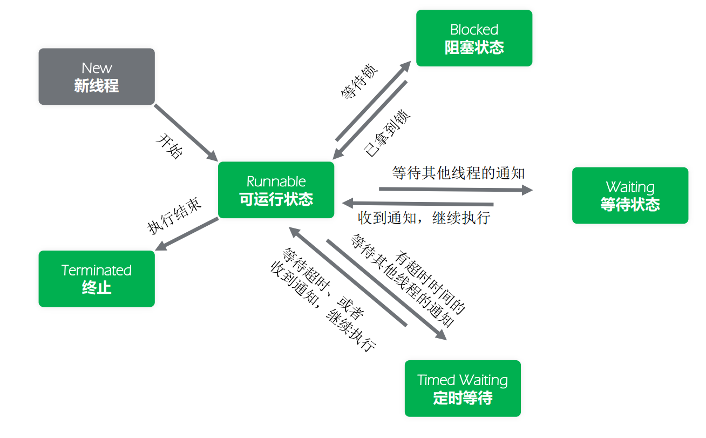
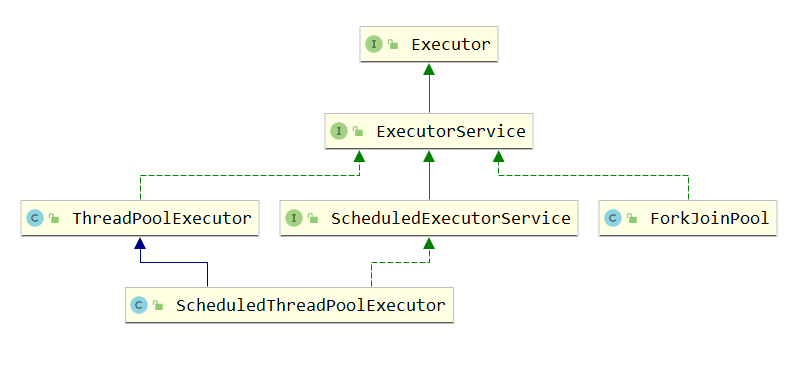
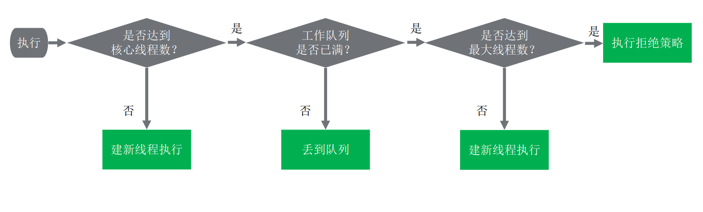
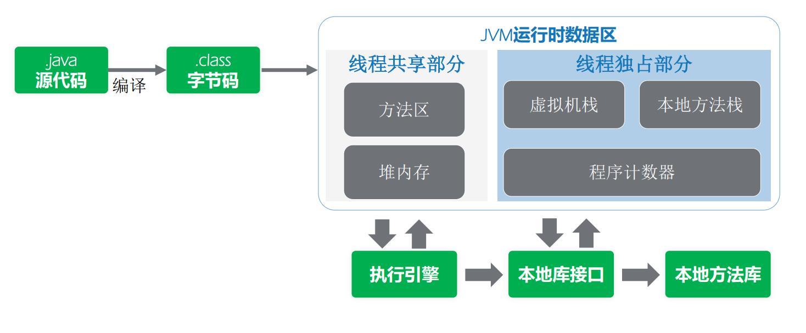
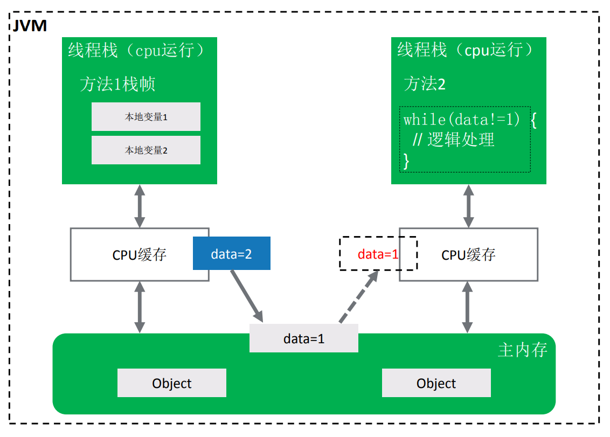
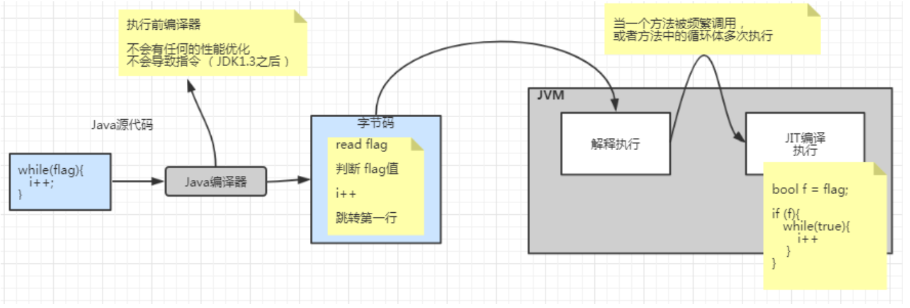
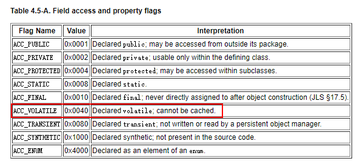

# 多线程


[TOC]

## 线程状态

**java.lang.Thread.State**定义的6种线程状态

| 线程状态      | 解释                                                         |
| ------------- | ------------------------------------------------------------ |
| New           | 尚未启动的线程的线程状态                                     |
| Runnable      | 可运行线程的线程状态，等待CPU调度                            |
| Blocked       | 线程阻塞等待监视器锁定的线程状态.处于synchronized同步代码块或方法中被阻塞 |
| Waiting       | 线程等待的线程状态。 不带timeout参数的方式调用Object.wait、Thread.join、LockSupport.park |
| Timed Waiting | 具有指定等待时间的等待线程的线程状态。下列带超时的方式： Thread.sleep、Object.wait、Thread.join、LockSupport.parkNanos、LockSupport.parkUntil |
| Terminated    | 终止线程的线程状态。线程正常完成执行或者出现异常             |



## 多线程基础

### 线程池原理

1. **线程池管理器** 用于创建并管理线程池，包括创建线程池，销毁线程池，添加新任务
2. **工作线程** 线程池中线程，可以循环的执行任务，在没有任务时处于等待状态
3. **任务接口** 每个任务必须实现的接口，以供工作线程调度任务的执行，它主要规定了任务的 入口，任务执行完后的收尾工作，任务的执行状态等
4. **任务队列** 用于存放没有处理的任务。提供一种缓冲机制

### 线程池类结构



| 类型   | 名称                        |                                                      |
| ------ | --------------------------- | ---------------------------------------------------- |
| 接口   | Executor                    | 最上层的接口，只定义了 execute                       |
| 接口   | ExecutorService             | 继承了Executor接口，拓展了Callable, Future, 关闭方法 |
| 接口   | ScheduledExecutorService    | 继承了ExecutorService，增加了定时任务相关的方法      |
| 实现类 | ThreadPoolExecutor          | **基础、标准的线程池实现**                           |
| 实现类 | ScheduledThreadPoolExecutor | 实现了 ScheduledExecutorService中相关定时任务的方法  |

## **ExecutorService 接口**

```java
public interface ExecutorService extends Executor {

    /**
     * 优雅的关闭线程池
     * 根据之前提交的任务顺序开始shutdown，但不会接受新的任务
     * 如果已经shutdown，调用本方法不会有任何影响
     */
    void shutdown();

    /**
     * 立马关闭线程池，粗暴的结束
     * 1. 尝试停止所有正在执行的task
     * 2. 不再执行正在等待的task，并且返回一个等待执行的task列表
     * 3. 不会再接受新的task
     * 这个方法不会等待正在执行的task结束，用awaitTermination方法可以做到
     * 除了尝试停止正在执行的任务之外，这个方法没有任何保证
     *
     * @return 返回一个等待执行的task列表
     */
    List<Runnable> shutdownNow();

    /**
     * 如果当前Executor已经被shutdown,则返回true
     */
    boolean isShutdown();

    /**
     * 如果在shutdown后，所有的task都执行完成，返回true，
     * 也就是说，只有执行了shutdown 或 shutdownNow后，该方法才有可能返回true
     */
    boolean isTerminated();

    /**
     * 调用本方法开始阻塞，直到出现如下条件之一：
     * 1、调用shutdown后所有的task都执行完成，
     * 2、或者达到timeout时间，
     * 3、或当前线程中断，
     */
    boolean awaitTermination(long timeout, TimeUnit unit) throws InterruptedException;

    /**
     * 提交一个有返回值的任务，并且返回一个future代表task后面的执行结果，
     * future的get方法会返回task的执行结果
     */
    <T> Future<T> submit(Callable<T> task);

    /**
     * 提交一个任务，并自己指定返回结果，
     * 任务执行后得到一个future，
     * 这个future的get方法会返回你指定的result
     */
    <T> Future<T> submit(Runnable task, T result);

    /**
     * 提交一个任务，任务执行后得到一个future，这个future的get方法会返回null
     */
    Future<?> submit(Runnable task);

    /**
     * 执行给定的一些task，当所有任务执行完成后，返回一个Future列表，
     * 列表里面有执行的状态和结果
     */
    <T> List<Future<T>> invokeAll(Collection<? extends Callable<T>> tasks)
            throws InterruptedException;

    /**
     * 执行给定的一组tasks，返回一个列表，列表中有他们的状态和结果
     * 当所有任务执行完成，或者到达超时时间，每个future的isDone属性都将是true
     * 没有执行完的任务，就被cancelled
     */
    <T> List<Future<T>> invokeAll(Collection<? extends Callable<T>> tasks,
                                  long timeout, TimeUnit unit)
            throws InterruptedException;

    /**
     * 执行指定的一组task，返回执行完成的那个任务的结果，如果任何一个任务成功，其他任务就会被cancelled掉
     * 方法执行时，若春如的集合被修改，返回结果将是undefined
     */
    <T> T invokeAny(Collection<? extends Callable<T>> tasks)
            throws InterruptedException, ExecutionException;

    <T> T invokeAny(Collection<? extends Callable<T>> tasks,
                    long timeout, TimeUnit unit)
            throws InterruptedException, ExecutionException, TimeoutException;
}

```

ThreadPoolExecutor典型使用

```java
//ThreadPoolExecutor构造方法
ThreadPoolExecutor(int corePoolSize,
                   int maximumPoolSize,
                   long keepAliveTime,
                   TimeUnit unit,
                   BlockingQueue<Runnable> workQueue,
                   ThreadFactory threadFactory,
                   RejectedExecutionHandler handler)
```

任务执行过程



Executors工具类

```java
//这个工具类alibaba Java开发规范不建议使用, 因为他使用没有大小限制的BlockingQuene,可能造成内存溢出

//创建一个固定大小、任务队列容量无界的线程池。核心线程数=最大线程数
public static ExecutorService newFixedThreadPool(int nThreads) {
    return new ThreadPoolExecutor(nThreads, nThreads,
                                  0L, TimeUnit.MILLISECONDS,
                                  new LinkedBlockingQueue<Runnable>());
}

//创建的是一个大小无界的缓冲线程池。它的任务队列是一个同步队列。任务加入到池中，如果
//池中有空闲线程，则用空闲线程执行，如无则创建新线程执行。池中的线程空闲超过60秒，将被销毁释放。线程数随任
//务的多少变化。适用于执行耗时较小的异步任务。池的核心线程数=0 ，最大线程数= Integer.MAX_VALUE
public static ExecutorService newCachedThreadPool() {
    return new ThreadPoolExecutor(0, Integer.MAX_VALUE, 60L, TimeUnit.SECONDS,
                                  new SynchronousQueue<Runnable>());
}
//只有一个线程来执行无界任务队列的单一线程池。该线程池确保任务按加入的顺序一个一
//个依次执行。当唯一的线程因任务异常中止时，将创建一个新的线程来继续执行后续的任务。与newFixedThreadPool(1)
//的区别在于，单一线程池的池大小在newSingleThreadExecutor方法中硬编码，不能再改变的。
public static ExecutorService newSingleThreadExecutor() {
    return new FinalizableDelegatedExecutorService( 
        new ThreadPoolExecutor(1, 1, 0L, TimeUnit.MILLISECONDS,
                                new LinkedBlockingQueue<Runnable>()));
}
//能定时执行任务的线程池。该池的核心线程数由参数指定，最大线程数=Integer.MAX_VALUE
public static ScheduledExecutorService newScheduledThreadPool(int corePoolSize) {
    return new ScheduledThreadPoolExecutor(corePoolSize);
}
```

保证合适的线程数

**计算型任务:** cpu数量的1-2倍

**IO型任务:** 相对比计算型任务，需多一些线程，要根据具体的IO阻塞时长进行考量决定。 也可考虑根据需要在一个最小数量和最大数量间自动增减线程数。

### 线程协作

数据交互存在的地方:

1. 文件共享
2. 网络共享
3. 共享变量


JDK协调工具: ~~**suspend/resume**~~, **wait/notify**, **park/unpark**

### suspend/resume

```java
public void suspendResumeTest() throws Exception {
    // 启动线程
    Thread consumerThread = new Thread(() -> {
        System.out.println("线程阻塞");
        Thread.currentThread().suspend();
        System.out.println("线程打开阻塞");
    });
    consumerThread.start();
    Thread.sleep(3000L);
    //通知线程
    consumerThread.resume();
    System.out.println("通知线程");
}
```

suspend/resume已经被启用, 原因是容易写吃死锁代码

```java
//死锁示例

//1. 同步代码中使用
public void suspendResumeTest() throws Exception {
    // 启动线程
    Thread consumerThread = new Thread(() -> {
        System.out.println("线程阻塞");
        synchronized (this) {
            Thread.currentThread().suspend();
        }
        System.out.println("线程打开阻塞");
    });
    consumerThread.start();
    Thread.sleep(3000L);
    //通知线程
    synchronized (this) {
        consumerThread.resume();
    }
    System.out.println("通知线程");
}

//suspend比resume后执行
public void suspendResumeTest() {
    // 启动线程
    Thread consumerThread = new Thread(() -> {
        try {
            System.out.println("线程阻塞");
            Thread.sleep(3000L);
        } catch (InterruptedException e) {
            e.printStackTrace();
        }
        Thread.currentThread().suspend();
        System.out.println("线程打开阻塞");
    });
    consumerThread.start();
    //通知线程
    consumerThread.resume();
    System.out.println("通知线程");
}
```

### wait/notify机制

wait方法导致当前线程等待，加入该对象的等待集合中，并且放弃当前持有的对象锁

notify/notifyAll方法唤醒一个或所有正在等待这个对象锁的线程

**注意:**

1. 虽然会wait自动解锁，但是对顺序有要求， 如果在notify被调用之后，才开始wait方法 的调用，线程会永远处于WAITING状态。
2. 这些方法只能由同一对象锁的持有者线程调用，也就是写在同步块里面，否则会抛出illegalMonitorStateException异常。

```java
public void waitnotifydemo() throws InterruptedException {
    Thread thread = new Thread(() -> {
        synchronized (this) {
            try {
                System.out.println("锁");
                this.wait();
                System.out.println("等待后");
            } catch (InterruptedException e) {
                e.printStackTrace();
            }
        }
    });
    thread.start();
    Thread.sleep(1000);
    System.out.println("打开锁");
    synchronized (this) {
        notify();
    }
    System.out.println("notify");
}
```

wait/notify也会出现死锁,notify 比 wait 后执行时，会出现死锁

```java
public void asd() throws InterruptedException {
    Thread thread = new Thread(() -> {
        try {
            Thread.sleep(2000);
        } catch (InterruptedException e) {
            e.printStackTrace();
        }
        synchronized (this) {
            try {
                System.out.println("锁");
                this.wait();
                System.out.println("等待后");
            } catch (InterruptedException e) {
                e.printStackTrace();
            }
        }
    });
    thread.start();
    System.out.println("打开锁");
    synchronized (this) {
        notify();
    }
    System.out.println("notify");
}
```

### park/unpark机制

线程调用park则等待“许可” ，unpark方法为指定线程提供“许可(permit)”, 调用unpark之后，再调用park，线程会直接运行.提前调用的unpark不叠加，连续多次调用unpark后，第一次调用park后会拿到“许可”直接 运行，后续调用会进入等待。

```java
public void pu() throws InterruptedException {
    Thread thread = new Thread(() -> {
        System.out.println("Park");
        LockSupport.park();
    });
    thread.start();
    Thread.sleep(3000L);
    LockSupport.unpark(thread);
}
```

在同步块中使用park/unpark, 容易出现死锁

```java
public void pu() throws InterruptedException {
    Thread thread = new Thread(() -> {
        System.out.println("Park");
        synchronized (this) {
            LockSupport.park();
        }
    });
    thread.start();
    Thread.sleep(3000L);
    synchronized (this) {
        LockSupport.unpark(thread);
    }
}
```

### 总结

| 协作方式       | 死锁方式1(锁) | 死锁方式2(先唤醒再挂起) | 备注                     |
| -------------- | ------------- | ----------------------- | ------------------------ |
| suspend/resume | 死锁          | 死锁                    | 弃用                     |
| wait/notify    | 不死锁        | 死锁                    | 只用于synchronized关键字 |
| park/unpark    | 死锁          | 不死锁                  |                          |

## Java内存模型

搞清楚Java内存模型和JVM运行时数据区

- **Java内存模型**: 是Java语言规范的一部分. 他描述多线程程序的一些合法行为
- **JVM运行时数据区**: 用来描述JVM特性

### Java内存模型

描述了**多线程程序的语义,**包括当多个线程修改了共享内存中的值时, 应该读取到哪个值的规则. 由于这部分规范类似于不同硬件体系结构的内存模型，因此这些语义称为Java编程语言内存模 型

### **JVM运行时数据区**



**线程独占**： 每个线程都会有它独立的空间，随线程生命周期而创建和销毁

**线程共享**： 所有线程能访问这块内存数据，随虚拟机或者GC而创建和销毁

### 提出Java内存模型的原因

现在有如下代码

```java
public class JavaMemModelQues {
    int i = 0;
    boolean isRunning = true;

    public static void main(String[] args) throws InterruptedException {
        JavaMemModelQues ques = new JavaMemModelQues();
        new Thread(() -> {
            System.out.println("here i am...");
            while (ques.isRunning) {
                ques.i++;
            }
            System.out.println("i: " + ques.i);
        }).start();

        Thread.sleep(3000L);
        ques.isRunning = false;
        System.out.println("shutdown ...");
    }
}
```

使用32位jdk使用jvm参数`-client` 能够看到打印i的值, 但是使用`-server`就不能看到i打印的值(包括64位jdk)

可能的情况有两种:

**CPU高速缓存**



**CPU指令重排**

Java编程语言的语义允许Java编译器和微处理器进行执行优化，这些优化导致了与其交 互的代码不再同步，从而导致看似矛盾的行为。

> Java CPU指令重排只能保证当前线程的最终结果一致
>
> Java 是编译型和解释型语言的结合体
>
> 由 Java 语言编写的程序需要经过编译来生成字节码（也就是 .class 文件），但这种字节码不是可执行性的，所以再由 Java 解释器（ JVM ）来解释执行。JAVA 虚拟机，即 JVM ( Java Virtual Machine )负责解释行字节码文件。所有平台上的 JVM 向编译器提供相同的编程接口，而编译器只需要面向虚拟机，生成虚拟机能理解的代码，然后由虚拟机来解释执行。
>
> JAVA 的执行过程：
>  在 Java 开发环境中进行程序代码的输入，生成 .java 的 Java 源文件。再由 Java 编译器对源文件编译成字节码（.class 文件），最后再由 JVM 将字节码解释成机器码执行并显示运行结果。
>
> JAVA 语言既不是纯粹的编译语言，也不是纯粹的解释性语言。所以运行 JAVA 程序必须经过编译 、运行两个步骤。



### volatile关键字

可见性: 让一个线程对共享变量的修改,能够及时的被其他线程看到


> Java内存模型中规定:
>
> - 对某个volatile 字段的写操作 happens-before 每个后续对该 volatile 字段的读操作
> - 对 volatile 变量 v 的写入，与所有其他线程后续对 v 的读同步


> JVM虚拟机规范实现规范
>
> - 禁止缓存:
>
>   volatile变量的访问控制符会加个ACC_VOLATILE
>
>   https://docs.oracle.com/javase/specs/jvms/se8/html/jvms-4.html#jvms-4.5
>
>   
>
> - 对volatile变量的相关指令不做重排序(和缓存相关)